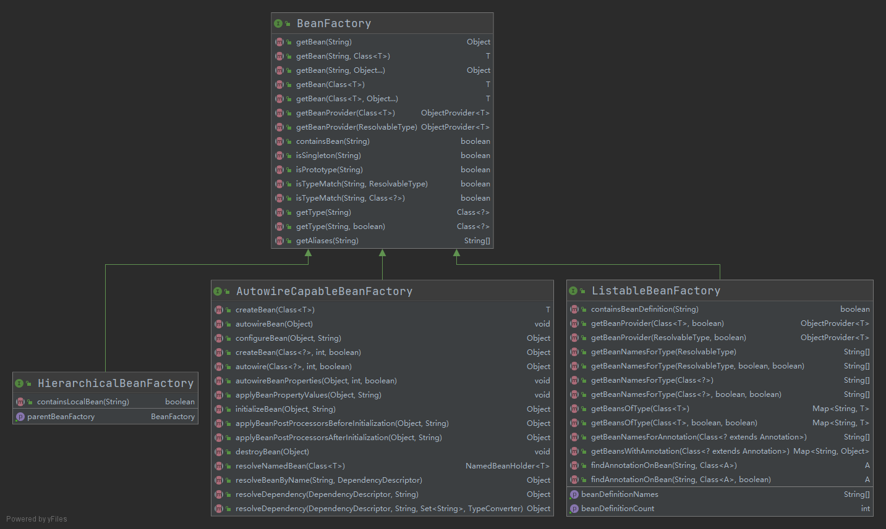

### BeanFactory 

​	最顶层的一个接口类，它定义了 IOC 容器的基本功能规范.

​	BeanFactory 有三个重要的子类：**ListableBeanFactory**、**HierarchicalBeanFactory** 和 **AutowireCapableBeanFactory**。例如 ListableBeanFactory 接口表示这些 Bean 是可列表化的，而 HierarchicalBeanFactory 表示的是这些 Bean 是有继承关系的，也就是每个 Bean 有可能有父 Bean。AutowireCapableBeanFactory 接口定义 Bean 的自动装配规则。这三个接口共同定义了 Bean 的集合、Bean 之间的关系、以及 Bean 行为。



#### HierarchicalBeanFactory

```java

package org.springframework.beans.factory;

import org.springframework.lang.Nullable;

/**
 * Sub-interface implemented by bean factories that can be part
 * of a hierarchy.
 *
 * <p>The corresponding {@code setParentBeanFactory} method for bean
 * factories that allow setting the parent in a configurable
 * fashion can be found in the ConfigurableBeanFactory interface.
 *
 * @author Rod Johnson
 * @author Juergen Hoeller
 * @since 07.07.2003
 * @see org.springframework.beans.factory.config.ConfigurableBeanFactory#setParentBeanFactory
 */
/*
 * 由可以成为层次结构一部分的 bean 工厂实现的子接口。
 */
public interface HierarchicalBeanFactory extends BeanFactory {

	/**
	 *	返回bean父工厂
	 */
	@Nullable
	BeanFactory getParentBeanFactory();

	/**
	 *返回本地 bean 工厂是否包含给定名称的 bean，忽略上下文中定义的 bean
	 */
	boolean containsLocalBean(String name);

}

```

#### ListableBeanFactory

```java
package org.springframework.beans.factory;

import java.lang.annotation.Annotation;
import java.util.Map;

import org.springframework.beans.BeansException;
import org.springframework.core.ResolvableType;
import org.springframework.lang.Nullable;

/**
 * Extension of the {@link BeanFactory} interface to be implemented by bean factories
 * that can enumerate all their bean instances, rather than attempting bean lookup
 * by name one by one as requested by clients. BeanFactory implementations that
 * preload all their bean definitions (such as XML-based factories) may implement
 * this interface.
 *
 * <p>If this is a {@link HierarchicalBeanFactory}, the return values will <i>not</i>
 * take any BeanFactory hierarchy into account, but will relate only to the beans
 * defined in the current factory. Use the {@link BeanFactoryUtils} helper class
 * to consider beans in ancestor factories too.
 *
 * <p>The methods in this interface will just respect bean definitions of this factory.
 * They will ignore any singleton beans that have been registered by other means like
 * {@link org.springframework.beans.factory.config.ConfigurableBeanFactory}'s
 * {@code registerSingleton} method, with the exception of
 * {@code getBeanNamesForType} and {@code getBeansOfType} which will check
 * such manually registered singletons too. Of course, BeanFactory's {@code getBean}
 * does allow transparent access to such special beans as well. However, in typical
 * scenarios, all beans will be defined by external bean definitions anyway, so most
 * applications don't need to worry about this differentiation.
 *
 * <p><b>NOTE:</b> With the exception of {@code getBeanDefinitionCount}
 * and {@code containsBeanDefinition}, the methods in this interface
 * are not designed for frequent invocation. Implementations may be slow.
 *
 * @author Rod Johnson
 * @author Juergen Hoeller
 * @since 16 April 2001
 * @see HierarchicalBeanFactory
 * @see BeanFactoryUtils
 */
public interface ListableBeanFactory extends BeanFactory {

	/**
	 * 检查此 bean 工厂是否包含具有给定名称的 bean 定义。
	 */
	boolean containsBeanDefinition(String beanName);

	/**
	 * 返回工厂中定义的 bean 数量。
	 * 
	 */
	int getBeanDefinitionCount();

	/**
	 * 返回此工厂中定义的所有 bean 的名称。
	 */
	String[] getBeanDefinitionNames();

	/**
	 * 获取bean的提供者
	 * @param requiredType bean 必须匹配的类型；可以是接口或超类
	 * @param allowEagerInit 基于流的访问是否可以初始化
	 */
	<T> ObjectProvider<T> getBeanProvider(Class<T> requiredType, boolean allowEagerInit);

	/**
	 * @param requiredType 
	 */
	<T> ObjectProvider<T> getBeanProvider(ResolvableType requiredType, boolean allowEagerInit);

	/**
	 * 返回与给定类型（包括子类）匹配的 bean 的名称，从 bean 定义或在 FactoryBeans 的情况下的值判断。
	 */
	String[] getBeanNamesForType(ResolvableType type);

	/**
	 * Return the names of beans matching the given type (including subclasses),
	 * judging from either bean definitions or the value of {@code getObjectType}
	 * in the case of FactoryBeans.
	 * @param 
	 * @param includeNonSingletons 是否也包括原型或范围 bean 或仅包括单例
	 * @param allowEagerInit
	 */
	String[] getBeanNamesForType(ResolvableType type, boolean includeNonSingletons, boolean allowEagerInit);

	/**
	 *
	 */
	String[] getBeanNamesForType(@Nullable Class<?> type);

	/**
	 *
	 */
	String[] getBeanNamesForType(@Nullable Class<?> type, boolean includeNonSingletons, boolean allowEagerInit);

	/**
	 *
	 */
	<T> Map<String, T> getBeansOfType(@Nullable Class<T> type) throws BeansException;

	/*
	 *
	 */
	<T> Map<String, T> getBeansOfType(@Nullable Class<T> type, boolean includeNonSingletons, boolean allowEagerInit)
			throws BeansException;

	/**
	 * 
	 */
	String[] getBeanNamesForAnnotation(Class<? extends Annotation> annotationType);

	/**
	 *
	 */
	Map<String, Object> getBeansWithAnnotation(Class<? extends Annotation> annotationType) throws BeansException;

	/**
	 *
	 */
	@Nullable
	<A extends Annotation> A findAnnotationOnBean(String beanName, Class<A> annotationType)
			throws NoSuchBeanDefinitionException;

	/**
	 * 
	 */
	@Nullable
	<A extends Annotation> A findAnnotationOnBean(
			String beanName, Class<A> annotationType, boolean allowFactoryBeanInit)
			throws NoSuchBeanDefinitionException;

}

```

#### AutowireCapableBeanFactory

```java
/*
 * Copyright 2002-2019 the original author or authors.
 *
 * Licensed under the Apache License, Version 2.0 (the "License");
 * you may not use this file except in compliance with the License.
 * You may obtain a copy of the License at
 *
 *      https://www.apache.org/licenses/LICENSE-2.0
 *
 * Unless required by applicable law or agreed to in writing, software
 * distributed under the License is distributed on an "AS IS" BASIS,
 * WITHOUT WARRANTIES OR CONDITIONS OF ANY KIND, either express or implied.
 * See the License for the specific language governing permissions and
 * limitations under the License.
 */

package org.springframework.beans.factory.config;

import java.util.Set;

import org.springframework.beans.BeansException;
import org.springframework.beans.TypeConverter;
import org.springframework.beans.factory.BeanFactory;
import org.springframework.beans.factory.NoSuchBeanDefinitionException;
import org.springframework.beans.factory.NoUniqueBeanDefinitionException;
import org.springframework.lang.Nullable;

/**
 * Extension of the {@link org.springframework.beans.factory.BeanFactory}
 * interface to be implemented by bean factories that are capable of
 * autowiring, provided that they want to expose this functionality for
 * existing bean instances.
 *
 * <p>This subinterface of BeanFactory is not meant to be used in normal
 * application code: stick to {@link org.springframework.beans.factory.BeanFactory}
 * or {@link org.springframework.beans.factory.ListableBeanFactory} for
 * typical use cases.
 *
 * <p>Integration code for other frameworks can leverage this interface to
 * wire and populate existing bean instances that Spring does not control
 * the lifecycle of. This is particularly useful for WebWork Actions and
 * Tapestry Page objects, for example.
 *
 * <p>Note that this interface is not implemented by
 * {@link org.springframework.context.ApplicationContext} facades,
 * as it is hardly ever used by application code. That said, it is available
 * from an application context too, accessible through ApplicationContext's
 * {@link org.springframework.context.ApplicationContext#getAutowireCapableBeanFactory()}
 * method.
 *
 * <p>You may also implement the {@link org.springframework.beans.factory.BeanFactoryAware}
 * interface, which exposes the internal BeanFactory even when running in an
 * ApplicationContext, to get access to an AutowireCapableBeanFactory:
 * simply cast the passed-in BeanFactory to AutowireCapableBeanFactory.
 *
 * @author Juergen Hoeller
 * @since 04.12.2003
 * @see org.springframework.beans.factory.BeanFactoryAware
 * @see org.springframework.beans.factory.config.ConfigurableListableBeanFactory
 * @see org.springframework.context.ApplicationContext#getAutowireCapableBeanFactory()
 */
public interface AutowireCapableBeanFactory extends BeanFactory {

	/**
	 * 表示没有外部定义的自动装配的常量。请注意，仍将应用 BeanFactoryAware 等和注释驱动的注入。
	 */
	int AUTOWIRE_NO = 0;

	/**
	 * 表示按名称自动装配 bean 属性的常量
	 * @see #createBean
	 * @see #autowire
	 * @see #autowireBeanProperties
	 */
	int AUTOWIRE_BY_NAME = 1;

	/**
	 * 指示按类型自动装配 bean 属性的常量
	 * @see #createBean
	 * @see #autowire
	 * @see #autowireBeanProperties
	 */
	int AUTOWIRE_BY_TYPE = 2;

	/**
	 * Constant that indicates autowiring the greediest constructor that
	 * can be satisfied (involves resolving the appropriate constructor).
	 * @see #createBean
	 * @see #autowire
	 */
	int AUTOWIRE_CONSTRUCTOR = 3;

	/**
	 * 构造方法注入常量
	 * @see #createBean
	 * @see #autowire
	 * @deprecated as of Spring 3.0: If you are using mixed autowiring strategies,
	 * prefer annotation-based autowiring for clearer demarcation of autowiring needs.
	 */
	@Deprecated
	int AUTOWIRE_AUTODETECT = 4;

	/**
	 * Suffix for the "original instance" convention when initializing an existing
	 * bean instance: to be appended to the fully-qualified bean class name,
	 * e.g. "com.mypackage.MyClass.ORIGINAL", in order to enforce the given instance
	 * to be returned, i.e. no proxies etc.
	 * @since 5.1
	 * @see #initializeBean(Object, String)
	 * @see #applyBeanPostProcessorsBeforeInitialization(Object, String)
	 * @see #applyBeanPostProcessorsAfterInitialization(Object, String)
	 */
	String ORIGINAL_INSTANCE_SUFFIX = ".ORIGINAL";


	//-------------------------------------------------------------------------
	// Typical methods for creating and populating external bean instances
	//-------------------------------------------------------------------------

	/**
	 * Fully create a new bean instance of the given class.
	 * <p>Performs full initialization of the bean, including all applicable
	 * {@link BeanPostProcessor BeanPostProcessors}.
	 * <p>Note: This is intended for creating a fresh instance, populating annotated
	 * fields and methods as well as applying all standard bean initialization callbacks.
	 * It does <i>not</i> imply traditional by-name or by-type autowiring of properties;
	 * use {@link #createBean(Class, int, boolean)} for those purposes.
	 * @param beanClass the class of the bean to create
	 * @return the new bean instance
	 * @throws BeansException if instantiation or wiring failed
	 */
	<T> T createBean(Class<T> beanClass) throws BeansException;

	/**
	 * Populate the given bean instance through applying after-instantiation callbacks
	 * and bean property post-processing (e.g. for annotation-driven injection).
	 * <p>Note: This is essentially intended for (re-)populating annotated fields and
	 * methods, either for new instances or for deserialized instances. It does
	 * <i>not</i> imply traditional by-name or by-type autowiring of properties;
	 * use {@link #autowireBeanProperties} for those purposes.
	 * @param existingBean the existing bean instance
	 * @throws BeansException if wiring failed
	 */
	void autowireBean(Object existingBean) throws BeansException;

	/**
	 * Configure the given raw bean: autowiring bean properties, applying
	 * bean property values, applying factory callbacks such as {@code setBeanName}
	 * and {@code setBeanFactory}, and also applying all bean post processors
	 * (including ones which might wrap the given raw bean).
	 * <p>This is effectively a superset of what {@link #initializeBean} provides,
	 * fully applying the configuration specified by the corresponding bean definition.
	 * <b>Note: This method requires a bean definition for the given name!</b>
	 * @param existingBean the existing bean instance
	 * @param beanName the name of the bean, to be passed to it if necessary
	 * (a bean definition of that name has to be available)
	 * @return the bean instance to use, either the original or a wrapped one
	 * @throws org.springframework.beans.factory.NoSuchBeanDefinitionException
	 * if there is no bean definition with the given name
	 * @throws BeansException if the initialization failed
	 * @see #initializeBean
	 */
	Object configureBean(Object existingBean, String beanName) throws BeansException;


	//-------------------------------------------------------------------------
	// Specialized methods for fine-grained control over the bean lifecycle
	//-------------------------------------------------------------------------

	/**
	 * Fully create a new bean instance of the given class with the specified
	 * autowire strategy. All constants defined in this interface are supported here.
	 * <p>Performs full initialization of the bean, including all applicable
	 * {@link BeanPostProcessor BeanPostProcessors}. This is effectively a superset
	 * of what {@link #autowire} provides, adding {@link #initializeBean} behavior.
	 * @param beanClass the class of the bean to create
	 * @param autowireMode by name or type, using the constants in this interface
	 * @param dependencyCheck whether to perform a dependency check for objects
	 * (not applicable to autowiring a constructor, thus ignored there)
	 * @return the new bean instance
	 * @throws BeansException if instantiation or wiring failed
	 * @see #AUTOWIRE_NO
	 * @see #AUTOWIRE_BY_NAME
	 * @see #AUTOWIRE_BY_TYPE
	 * @see #AUTOWIRE_CONSTRUCTOR
	 */
	Object createBean(Class<?> beanClass, int autowireMode, boolean dependencyCheck) throws BeansException;

	/**
	 * Instantiate a new bean instance of the given class with the specified autowire
	 * strategy. All constants defined in this interface are supported here.
	 * Can also be invoked with {@code AUTOWIRE_NO} in order to just apply
	 * before-instantiation callbacks (e.g. for annotation-driven injection).
	 * <p>Does <i>not</i> apply standard {@link BeanPostProcessor BeanPostProcessors}
	 * callbacks or perform any further initialization of the bean. This interface
	 * offers distinct, fine-grained operations for those purposes, for example
	 * {@link #initializeBean}. However, {@link InstantiationAwareBeanPostProcessor}
	 * callbacks are applied, if applicable to the construction of the instance.
	 * @param beanClass the class of the bean to instantiate
	 * @param autowireMode by name or type, using the constants in this interface
	 * @param dependencyCheck whether to perform a dependency check for object
	 * references in the bean instance (not applicable to autowiring a constructor,
	 * thus ignored there)
	 * @return the new bean instance
	 * @throws BeansException if instantiation or wiring failed
	 * @see #AUTOWIRE_NO
	 * @see #AUTOWIRE_BY_NAME
	 * @see #AUTOWIRE_BY_TYPE
	 * @see #AUTOWIRE_CONSTRUCTOR
	 * @see #AUTOWIRE_AUTODETECT
	 * @see #initializeBean
	 * @see #applyBeanPostProcessorsBeforeInitialization
	 * @see #applyBeanPostProcessorsAfterInitialization
	 */
	Object autowire(Class<?> beanClass, int autowireMode, boolean dependencyCheck) throws BeansException;

	/**
	 * Autowire the bean properties of the given bean instance by name or type.
	 * Can also be invoked with {@code AUTOWIRE_NO} in order to just apply
	 * after-instantiation callbacks (e.g. for annotation-driven injection).
	 * <p>Does <i>not</i> apply standard {@link BeanPostProcessor BeanPostProcessors}
	 * callbacks or perform any further initialization of the bean. This interface
	 * offers distinct, fine-grained operations for those purposes, for example
	 * {@link #initializeBean}. However, {@link InstantiationAwareBeanPostProcessor}
	 * callbacks are applied, if applicable to the configuration of the instance.
	 * @param existingBean the existing bean instance
	 * @param autowireMode by name or type, using the constants in this interface
	 * @param dependencyCheck whether to perform a dependency check for object
	 * references in the bean instance
	 * @throws BeansException if wiring failed
	 * @see #AUTOWIRE_BY_NAME
	 * @see #AUTOWIRE_BY_TYPE
	 * @see #AUTOWIRE_NO
	 */
	void autowireBeanProperties(Object existingBean, int autowireMode, boolean dependencyCheck)
			throws BeansException;

	/**
	 * Apply the property values of the bean definition with the given name to
	 * the given bean instance. The bean definition can either define a fully
	 * self-contained bean, reusing its property values, or just property values
	 * meant to be used for existing bean instances.
	 * <p>This method does <i>not</i> autowire bean properties; it just applies
	 * explicitly defined property values. Use the {@link #autowireBeanProperties}
	 * method to autowire an existing bean instance.
	 * <b>Note: This method requires a bean definition for the given name!</b>
	 * <p>Does <i>not</i> apply standard {@link BeanPostProcessor BeanPostProcessors}
	 * callbacks or perform any further initialization of the bean. This interface
	 * offers distinct, fine-grained operations for those purposes, for example
	 * {@link #initializeBean}. However, {@link InstantiationAwareBeanPostProcessor}
	 * callbacks are applied, if applicable to the configuration of the instance.
	 * @param existingBean the existing bean instance
	 * @param beanName the name of the bean definition in the bean factory
	 * (a bean definition of that name has to be available)
	 * @throws org.springframework.beans.factory.NoSuchBeanDefinitionException
	 * if there is no bean definition with the given name
	 * @throws BeansException if applying the property values failed
	 * @see #autowireBeanProperties
	 */
	void applyBeanPropertyValues(Object existingBean, String beanName) throws BeansException;

	/**
	 * Initialize the given raw bean, applying factory callbacks
	 * such as {@code setBeanName} and {@code setBeanFactory},
	 * also applying all bean post processors (including ones which
	 * might wrap the given raw bean).
	 * <p>Note that no bean definition of the given name has to exist
	 * in the bean factory. The passed-in bean name will simply be used
	 * for callbacks but not checked against the registered bean definitions.
	 * @param existingBean the existing bean instance
	 * @param beanName the name of the bean, to be passed to it if necessary
	 * (only passed to {@link BeanPostProcessor BeanPostProcessors};
	 * can follow the {@link #ORIGINAL_INSTANCE_SUFFIX} convention in order to
	 * enforce the given instance to be returned, i.e. no proxies etc)
	 * @return the bean instance to use, either the original or a wrapped one
	 * @throws BeansException if the initialization failed
	 * @see #ORIGINAL_INSTANCE_SUFFIX
	 */
	Object initializeBean(Object existingBean, String beanName) throws BeansException;

	/**
	 * Apply {@link BeanPostProcessor BeanPostProcessors} to the given existing bean
	 * instance, invoking their {@code postProcessBeforeInitialization} methods.
	 * The returned bean instance may be a wrapper around the original.
	 * @param existingBean the existing bean instance
	 * @param beanName the name of the bean, to be passed to it if necessary
	 * (only passed to {@link BeanPostProcessor BeanPostProcessors};
	 * can follow the {@link #ORIGINAL_INSTANCE_SUFFIX} convention in order to
	 * enforce the given instance to be returned, i.e. no proxies etc)
	 * @return the bean instance to use, either the original or a wrapped one
	 * @throws BeansException if any post-processing failed
	 * @see BeanPostProcessor#postProcessBeforeInitialization
	 * @see #ORIGINAL_INSTANCE_SUFFIX
	 */
	Object applyBeanPostProcessorsBeforeInitialization(Object existingBean, String beanName)
			throws BeansException;

	/**
	 * Apply {@link BeanPostProcessor BeanPostProcessors} to the given existing bean
	 * instance, invoking their {@code postProcessAfterInitialization} methods.
	 * The returned bean instance may be a wrapper around the original.
	 * @param existingBean the existing bean instance
	 * @param beanName the name of the bean, to be passed to it if necessary
	 * (only passed to {@link BeanPostProcessor BeanPostProcessors};
	 * can follow the {@link #ORIGINAL_INSTANCE_SUFFIX} convention in order to
	 * enforce the given instance to be returned, i.e. no proxies etc)
	 * @return the bean instance to use, either the original or a wrapped one
	 * @throws BeansException if any post-processing failed
	 * @see BeanPostProcessor#postProcessAfterInitialization
	 * @see #ORIGINAL_INSTANCE_SUFFIX
	 */
	Object applyBeanPostProcessorsAfterInitialization(Object existingBean, String beanName)
			throws BeansException;

	/**
	 * Destroy the given bean instance (typically coming from {@link #createBean}),
	 * applying the {@link org.springframework.beans.factory.DisposableBean} contract as well as
	 * registered {@link DestructionAwareBeanPostProcessor DestructionAwareBeanPostProcessors}.
	 * <p>Any exception that arises during destruction should be caught
	 * and logged instead of propagated to the caller of this method.
	 * @param existingBean the bean instance to destroy
	 */
	void destroyBean(Object existingBean);


	//-------------------------------------------------------------------------
	// Delegate methods for resolving injection points
	//-------------------------------------------------------------------------

	/**
	 * Resolve the bean instance that uniquely matches the given object type, if any,
	 * including its bean name.
	 * <p>This is effectively a variant of {@link #getBean(Class)} which preserves the
	 * bean name of the matching instance.
	 * @param requiredType type the bean must match; can be an interface or superclass
	 * @return the bean name plus bean instance
	 * @throws NoSuchBeanDefinitionException if no matching bean was found
	 * @throws NoUniqueBeanDefinitionException if more than one matching bean was found
	 * @throws BeansException if the bean could not be created
	 * @since 4.3.3
	 * @see #getBean(Class)
	 */
	<T> NamedBeanHolder<T> resolveNamedBean(Class<T> requiredType) throws BeansException;

	/**
	 * Resolve a bean instance for the given bean name, providing a dependency descriptor
	 * for exposure to target factory methods.
	 * <p>This is effectively a variant of {@link #getBean(String, Class)} which supports
	 * factory methods with an {@link org.springframework.beans.factory.InjectionPoint}
	 * argument.
	 * @param name the name of the bean to look up
	 * @param descriptor the dependency descriptor for the requesting injection point
	 * @return the corresponding bean instance
	 * @throws NoSuchBeanDefinitionException if there is no bean with the specified name
	 * @throws BeansException if the bean could not be created
	 * @since 5.1.5
	 * @see #getBean(String, Class)
	 */
	Object resolveBeanByName(String name, DependencyDescriptor descriptor) throws BeansException;

	/**
	 * Resolve the specified dependency against the beans defined in this factory.
	 * @param descriptor the descriptor for the dependency (field/method/constructor)
	 * @param requestingBeanName the name of the bean which declares the given dependency
	 * @return the resolved object, or {@code null} if none found
	 * @throws NoSuchBeanDefinitionException if no matching bean was found
	 * @throws NoUniqueBeanDefinitionException if more than one matching bean was found
	 * @throws BeansException if dependency resolution failed for any other reason
	 * @since 2.5
	 * @see #resolveDependency(DependencyDescriptor, String, Set, TypeConverter)
	 */
	@Nullable
	Object resolveDependency(DependencyDescriptor descriptor, @Nullable String requestingBeanName) throws BeansException;

	/**
	 * Resolve the specified dependency against the beans defined in this factory.
	 * @param descriptor the descriptor for the dependency (field/method/constructor)
	 * @param requestingBeanName the name of the bean which declares the given dependency
	 * @param autowiredBeanNames a Set that all names of autowired beans (used for
	 * resolving the given dependency) are supposed to be added to
	 * @param typeConverter the TypeConverter to use for populating arrays and collections
	 * @return the resolved object, or {@code null} if none found
	 * @throws NoSuchBeanDefinitionException if no matching bean was found
	 * @throws NoUniqueBeanDefinitionException if more than one matching bean was found
	 * @throws BeansException if dependency resolution failed for any other reason
	 * @since 2.5
	 * @see DependencyDescriptor
	 */
	@Nullable
	Object resolveDependency(DependencyDescriptor descriptor, @Nullable String requestingBeanName,
			@Nullable Set<String> autowiredBeanNames, @Nullable TypeConverter typeConverter) throws BeansException;

}

```

